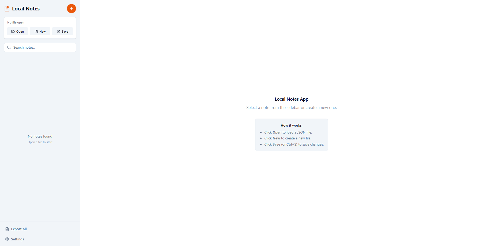
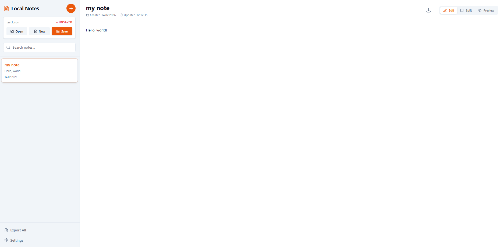
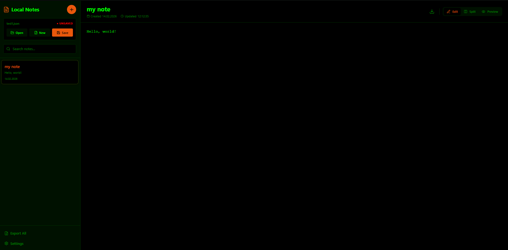

# Local Notes App

A secure, offline-first note-taking application that runs everywhere. Available as a portable **HTML file** for web browsers and as a **Desktop Application** for Windows (Electron).

Main form

Notes

Matrix mode

## Key Features

*   **🔒 100% Offline & Private:** Your data never leaves your device. Notes are stored in local JSON files that you control.
*   **📂 File System Integration:**
    *   **Desktop:** Opens and saves files directly to your hard drive using native dialogs.
    *   **Web:** Uses the File System Access API to read/write files directly from the browser (Chrome/Edge/Opera).
*   **📝 Markdown Editor:**
    *   Write in Markdown with a live split-view preview.
    *   **WYSIWYG-like experience:** Edit, Split, and Preview modes.
    *   **Full Width:** Distraction-free writing environment.
*   **🎨 Customization:**
    *   **Themes:** Light, Dark, and **Matrix** (Hacker style) modes.
    *   **Typography:** Adjustable font sizes for both interface and editor.
    *   **Colors:** Choose your preferred accent color.
*   **💾 Export Options:**
    *   Save your entire workspace as a `.json` file.
    *   Export individual notes as `.md` files.
    *   **Bulk Export:** Download all notes as a ZIP archive of Markdown files.
*   **🛡️ Data Safety:**
    *   Prevents accidental data loss with unsaved changes warnings.
    *   Auto-prompts to save new files.
    *   Prevents creating notes without an active file workspace.

## Installation & Usage

### Option 1: Portable Web Version (HTML)
The entire application is compiled into a **single HTML file**.

1.  Download `index.html` (from the release or build it yourself).
2.  Open it in **Google Chrome**, **Microsoft Edge**, or **Opera**.
3.  Click **Open** to load a JSON notes file, or **New** to create one.
4.  Start writing!

*Note: Firefox and Safari have limited support for the File System Access API used in this mode.*

### Option 2: Desktop Application (Windows)
A standalone `.exe` program that works like Notepad or Word.

1.  Download the installer/executable.
2.  Run the application.
3.  Use `File > Open` logic via the sidebar buttons to manage your notebooks.
4.  Use `Ctrl+S` to save instantly.

## Building from Source

Prerequisites: [Node.js](https://nodejs.org/) installed.

1.  **Clone the repository:**
    ```bash
    git clone https://github.com/your-username/local-notes-app.git
    cd local-notes-app
    ```

2.  **Install dependencies:**
    ```bash
    npm install
    ```

3.  **Build Web Version (HTML):**
    ```bash
    npm run build
    ```
    The output file will be at `dist/index.html`.

4.  **Build Desktop Version (EXE):**
    ```bash
    npm run electron:build
    ```
    The executable will be in the `dist` folder.

## Technologies Used

*   **React** - UI Framework
*   **TypeScript** - Type safety
*   **Tailwind CSS** - Styling
*   **Vite** - Build tool (SingleFile plugin)
*   **Electron** - Desktop integration
*   **Lucide React** - Icons
*   **React Markdown** - Markdown rendering

## License

MIT
